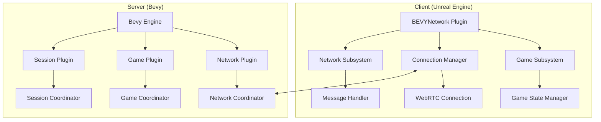
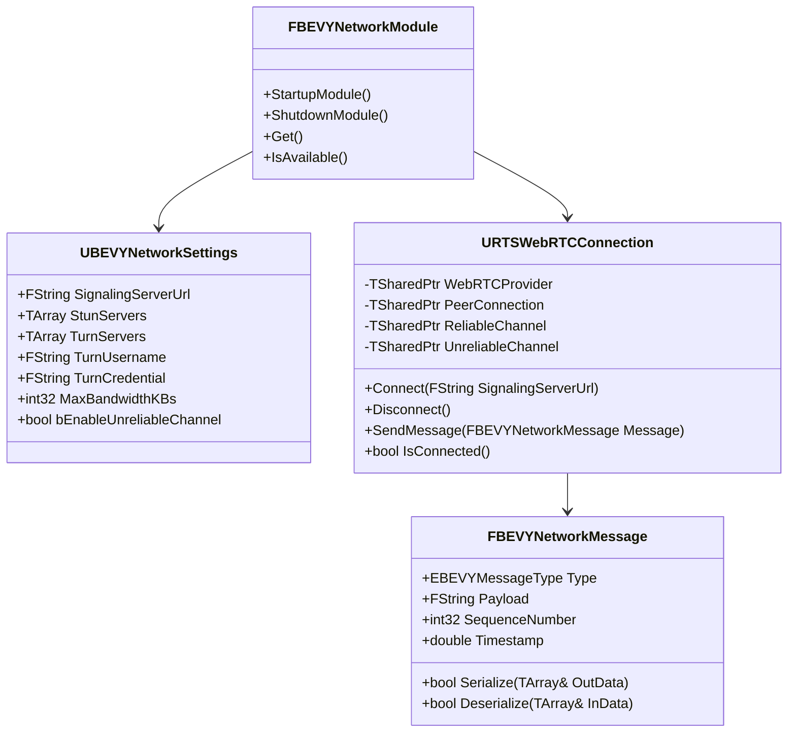
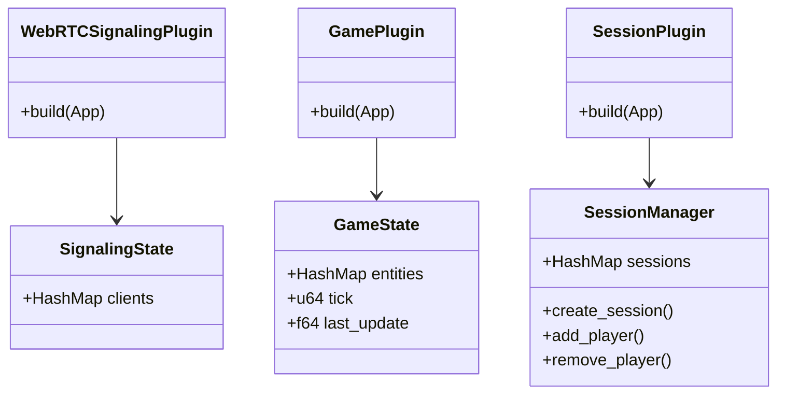
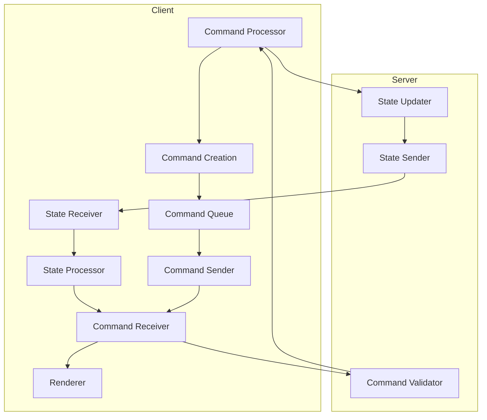
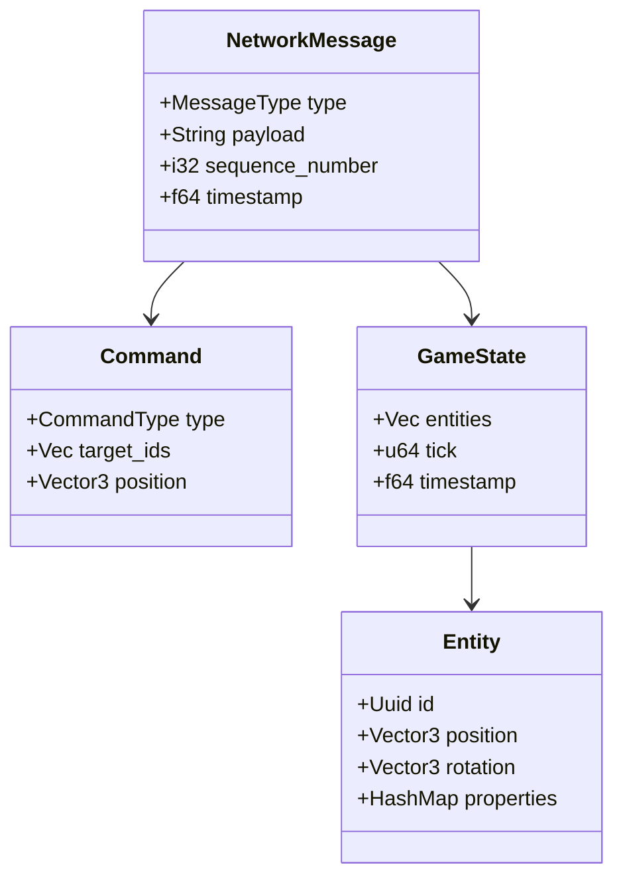

# BUERTS Class Diagrams

## System Overview



## Client Plugin Structure



## Server Architecture



## Network Protocol Flow

```mermaid
sequenceDiagram
    participant Client
    participant SignalingServer
    participant GameServer
    
    Client->>SignalingServer: Connect
    SignalingServer-->>Client: Accept
    
    Client->>SignalingServer: Create Offer
    SignalingServer->>GameServer: Forward Offer
    GameServer->>SignalingServer: Create Answer
    SignalingServer-->>Client: Send Answer
    
    loop ICE Candidates
        Client->>SignalingServer: ICE Candidate
        SignalingServer->>GameServer: Forward Candidate
        GameServer->>SignalingServer: ICE Candidate
        SignalingServer-->>Client: Forward Candidate
    end
    
    Client<->GameServer: WebRTC Connection Established
    
    loop Game Loop
        GameServer->>Client: State Update
        Client->>GameServer: Commands
        GameServer->>Client: State Reconciliation
    end
```

## State Synchronization



## Component Relationships


